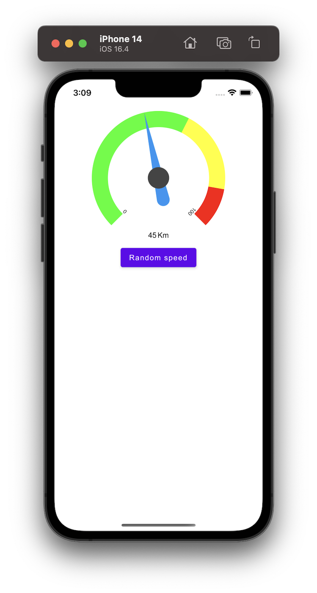
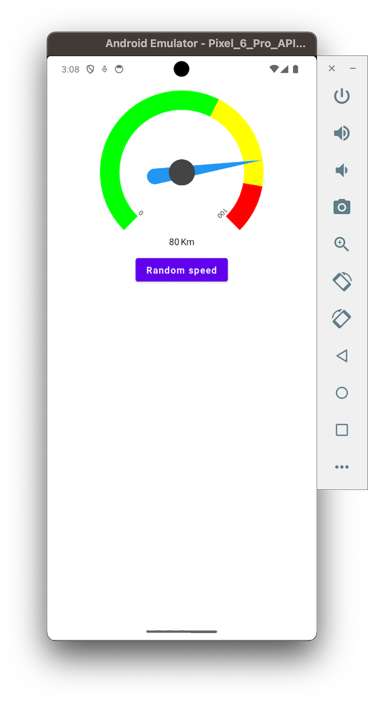
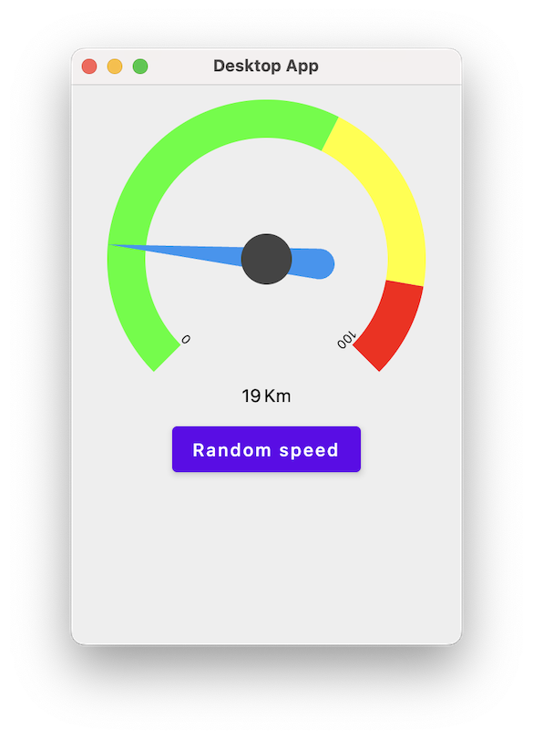

# Speedometer
Dynamic Speedometer widget for Compose Multiplatform. **amazing**, **powerful**, and _multi shape_ :zap: , you can change (colors, bar width, shape, text, font ...everything !!),
[see project on GitHub](https://github.com/anastr/Speedometer/).

This widget is drawn using Compose API only, which makes it work on all platforms that support Compose UI. You can use the Android View-UI [SpeedView](https://github.com/anastr/SpeedView/) library for XML View.

[](https://mvnrepository.com/artifact/com.github.anastr/speedometer/latest)
[](#)
[](http://twitter.com/AnasAltairDent)

**Speedometers...**<br/>




# Donations

This project needs you! If you would like to support this project, the creator of this project or the continuous maintenance of this project, feel free to donate. Your donation is highly appreciated. Thank you!

[](https://www.paypal.com/donate/?hosted_button_id=VQ9DDY2KSQLJW)


# Download
> This library still in alpha stage. Implementations might change in the future.

Requirements to use:

- Kotlin version `1.8.20` or above.
- Compose version `1.4.0`.
- Minimum API version `21` (For Android).

Add `mavenCentral` to your dependency management.

```kotlin
dependencyResolutionManagement {
    repositories {
        // ...
        mavenCentral()
    }
}
```

Then, add the speedometer dependencies according to your project:

## Compose Multiplatform Project

Go to `build.gradle.kts` file in the **shared module**. In `commonMain` dependencies:

```kotlin
sourceSets {
    val commonMain by getting {
        dependencies {
            // Add Speedometer library
            implementation("com.github.anastr:speedometer:1.0.0-ALPHA01")
        }
    }
    // ...
}
```

## Native Android Project

If you want to use the library only in a native Android project. Add this line to `build.gradle.kts` **app module level**:

```kotlin
dependencies {
    implementation("com.github.anastr:speedometer-android:1.0.0-ALPHA01")
}
```

# Simple Usage
Currently, this library only supports `SpeedView`. To use it, just call `SpeedView` composable like so:
```kotlin
MaterialTheme {
    SpeedView(
        modifier = Modifier.size(250.dp),
        speed = 50f,
    )
}
```

By default, this library doesn't implement any animation. To make the indicator move smoothly, use compose animation :
```kotlin
MaterialTheme {
    var speed by remember { mutableStateOf(0f) }
    val currentSpeed by animateFloatAsState(
        targetValue = speed,
        animationSpec = tween(durationMillis = 2000, easing = FastOutSlowInEasing)
    )
    Column(
        modifier = Modifier
            .fillMaxWidth()
            .padding(12.dp),
        horizontalAlignment = Alignment.CenterHorizontally,
    ) {
        SpeedView(
            modifier = Modifier.size(250.dp),
            speed = currentSpeed,
        )
        Button(
            onClick = {
                // Change speed to start the animation
                speed = Random.nextFloat() * 100
            },
        ) {
            Text("Random speed")
        }
    }
}
```
